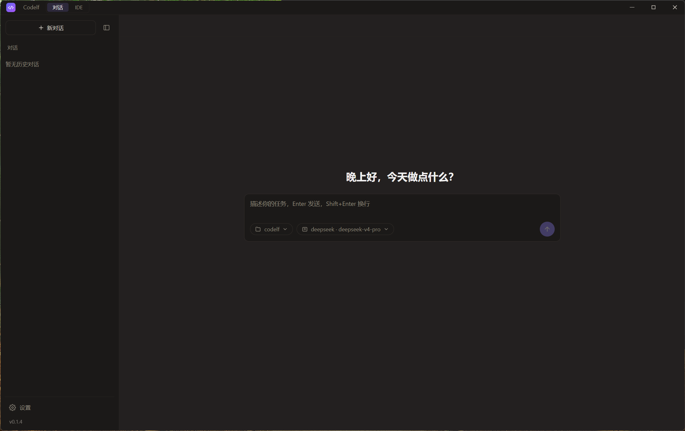
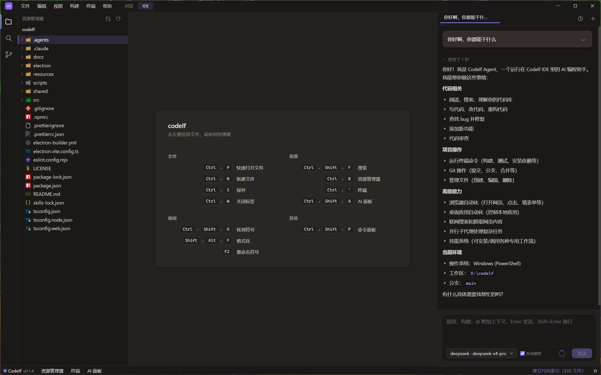
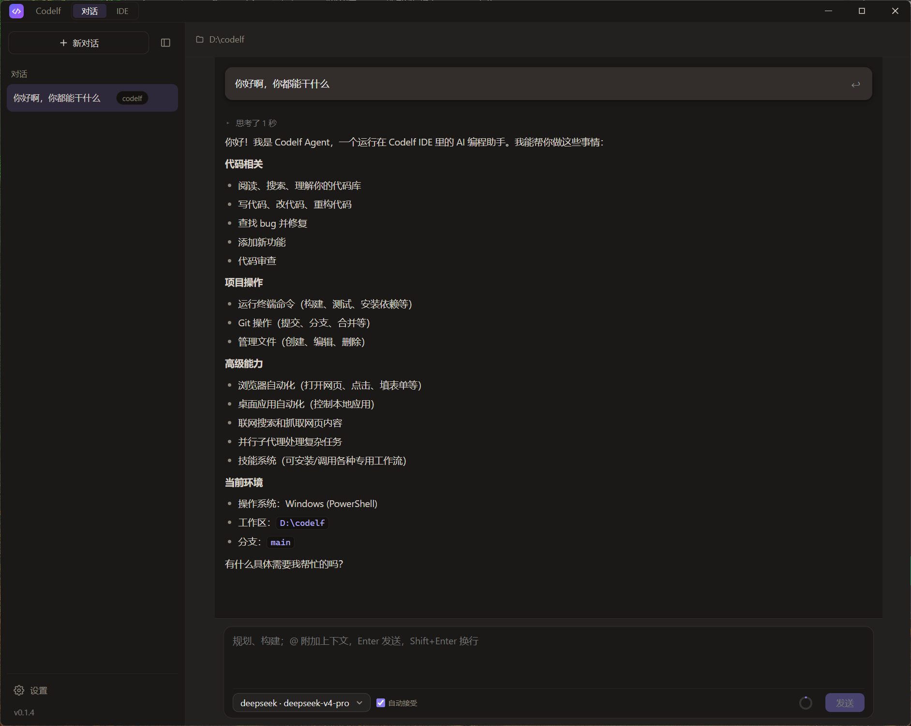
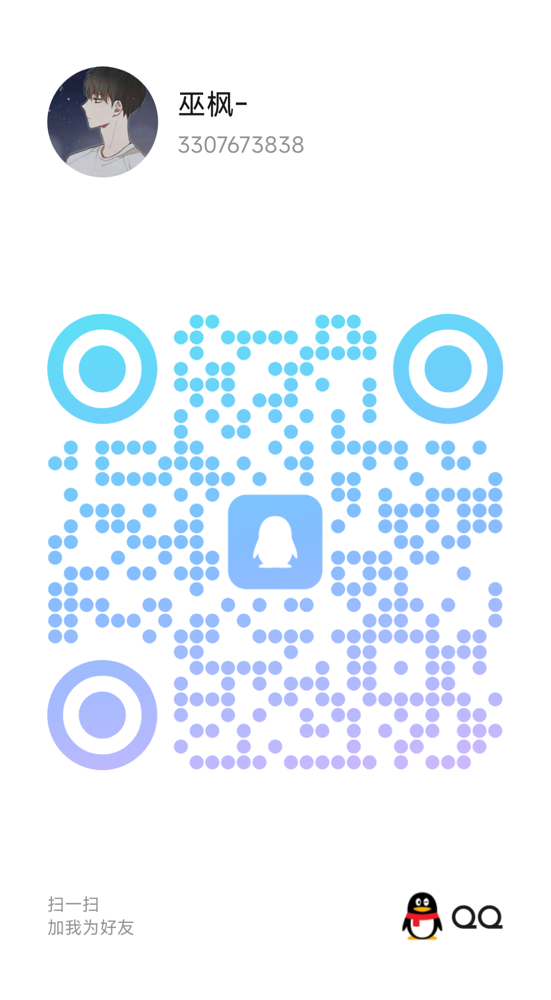

<div align="center">

# Codelf（码灵）

**用自然语言搞定任何事的 AI 助理**

你只管说想做什么，剩下的交给它。Codelf 是一个内置自主式 AI Agent 的桌面应用，能用大白话帮你开发项目、整理资料、操作电脑——也就是大家说的 vibecoding。它同样是一个功能完整的编辑器，写代码、跑终端、连浏览器、控制本地程序样样都行。


[界面预览](#界面预览) · [为什么选择](#为什么选择-codelf) · [它能做什么](#它能做什么) · [技术栈](#技术栈) · [快速开始](#快速开始) · [打包构建](#打包构建) · [官网](https://codelf.top) · [联系我](#联系我)

</div>

---

## 界面预览

<div align="center">



</div>

<table>
  <tr>
    <td width="50%"></td>
    <td width="50%"></td>
  </tr>
</table>

## 为什么选择 Codelf

一句话：在国内能直接用、支持各家大模型、还特别省钱的自然语言 AI 助理。

你不用懂代码，也不用学复杂操作——把想做的事用大白话说出来，它自己拆解步骤、调用工具、动手完成。无论是开发一个项目、改一份文档、跑一段数据，还是帮你操作电脑里的程序，都可以交给它。

- **对国内网络特别友好**。原生支持 DeepSeek 等国内可直连的模型，不用科学上网就能跑 AI。同时兼容任意 OpenAI 兼容接口，想接国内中转、自建网关、公司内网代理都行，配好就能用。

- **各大模型原生支持，想换就换**。DeepSeek、Claude、ChatGPT、Azure OpenAI 都内置好了，填上自己的 API Key 就能用。哪个便宜用哪个，哪个聪明用哪个，随时切换，不绑订阅。

- **超高的上下文缓存命中率，真的省钱**。我们专门优化了对话的组织方式，给每个会话生成稳定的缓存键，让模型供应商的 prompt 缓存尽可能命中。同样一段长上下文，命中缓存后的费用能差好几倍，长时间编码下来省下的是实打实的真金白银。

- **能帮你操控浏览器，也能操控桌面应用**。不只是写写代码——它能自己打开网页、点按钮、填表单、抓内容，也能启动你电脑上的桌面程序、读取界面、点击操作、截图查看，像个真正的电脑管家替你跑腿。

- **轻量、启动快**。没有臃肿的插件市场和后台服务，开箱即用，对话、编辑、终端、AI Agent 一应俱全。

- **数据都在你自己机器上**。纯本地桌面应用，代码与文件不经过任何第三方托管，安全可控。**知识库向量数据库也完全本地化**，企业内部文档不上传、不联网，敏感资料零泄露风险。

- **企业知识管理的得力助手**。内置本地 RAG（检索增强生成）系统，支持导入公司内部的技术文档、业务手册、产品规范、历史项目资料，AI 在回答问题时能自动检索相关内容引用，让 AI 助理真正懂你们的业务。表格、流程图、参数表等结构化信息完整保留，中文语义检索比关键词搜索准确得多，新人培训、技术答疑、规范查阅效率翻倍。

- **既是助理，也是趁手的工具台**。Monaco 编辑器、LSP 智能感知、集成终端、Git、全局搜索、命令面板，该有的都有——你想自己上手时随时能接管。

- **开源免费**。MIT 许可证，可以自由阅读、修改和分发。

## 它能做什么

- **帮你做事**：用一句话描述需求，自主式 AI Agent 就能自己读写文件、跑命令、搜资料、调工具，把多步骤的任务从头做到尾——无论是开发项目还是处理日常杂活。
- **会规划**：复杂任务先进只读的 Plan 模式调研、出方案，确认后再动手；每个回合都有检查点，做坏了能整体撤销。
- **企业知识库 RAG**：内置本地向量数据库，支持导入 **docx / xlsx / xls / pdf / doc / md / txt** 等企业常见文档格式，**表格完整保留、自动分块向量化**，让 AI 能检索公司规范、技术文档、业务资料，成为真正懂你们业务的智能助理。特别适合：
  - 📋 **技术文档管理**：API 文档、接口规范、架构设计书，AI 可直接引用回答技术问题
  - 📊 **业务知识沉淀**：产品手册、操作流程、数据字典，新人培训资料秒变 AI 助手
  - 🔍 **合规与标准**：公司制度、行业规范、质量标准，自动检索避免遗漏
  - 💡 **项目经验库**：历史项目文档、问题解决方案，避免重复踩坑
  - 完全本地化，数据不出企业内网，支持**中文语义检索**（内置 bge-small-zh-v1.5 模型），召回准确率远超关键词搜索
- **操控浏览器**：内置联网搜索、网页抓取和 Playwright 浏览器自动化，能自己打开网页、导航、点击、填表单、截图、抓取内容。
- **操控桌面应用**：跨平台控制你电脑里的本地程序——启动 / 关闭应用、读取窗口界面、点按钮、填文本、截图查看，把手动操作交给它。
- **可扩展**：支持 Agent Skills 一键安装可复用技能，支持接入 MCP（Model Context Protocol）的第三方工具与资源。
- **写代码也专业**：内置 TypeScript / Python / Vue / JSON / YAML 等语言服务，行内补全、选中改写、一键修复报错、自动生成提交信息，Python 环境自动发现并切换，界面与编辑器内置中文本地化。

## 技术栈

| 分类 | 技术 |
| --- | --- |
| 桌面框架 | Electron 33 |
| 构建工具 | electron-vite、Vite 5 |
| 前端 | React 18、Zustand、TypeScript 5 |
| 编辑器 | Monaco Editor、Shiki |
| 终端 | xterm.js、@lydell/node-pty |
| AI SDK | @anthropic-ai/sdk、openai、@modelcontextprotocol/sdk |
| 知识库 RAG | better-sqlite3、sqlite-vec、@huggingface/transformers（本地向量化）、mammoth（docx）、xlsx（Excel）、pdfjs-dist（PDF） |
| 语言服务 | basedpyright、typescript-language-server、vscode-langservers-extracted、yaml-language-server、@vue/language-server |
| 浏览器自动化 | Playwright |
| 打包 | electron-builder |

## 快速开始

### 环境要求
- Node.js >= 18
- npm（或 pnpm / yarn）

### 安装依赖

```bash
npm install
```

### 开发模式

```bash
npm run dev
```

启动后会以热更新模式打开应用窗口。

### 配置 AI 模型

首次使用时，在应用内的「设置」中填入对应供应商的 API Key（如 DeepSeek、Anthropic、OpenAI 等），即可开始使用 AI Agent 能力。

## 打包构建

```bash
# Windows 安装包（NSIS）
npm run dist

# Windows 免安装目录
npm run package

# macOS 安装包（dmg，支持 arm64 / x64）
npm run dist:mac
```

构建产物输出到 `release/` 目录。

## 联系我

有问题、建议或想交个朋友，欢迎扫码联系我：

<div align="center">

| 微信 | QQ |
| :---: | :---: |
|  |  |

</div>

## 许可证

本项目基于 [MIT](LICENSE) 许可证开源。

Copyright © 2026 巫枫
